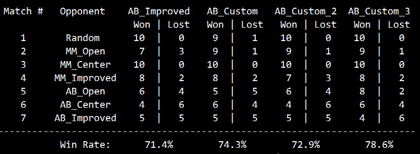

# heuristic_analysis

## custom_score 
### Algorithm Description:
In this game, generally a move that go to the center of the board is better,so we can evaluate the next move's distance to the center,then use the distance as the weight of the move, more closer,more better.  
- Evaluate every next legal moves, calculate the distance to the center of the board, we define it as: $d={(x-x_0)^2+(y-y_0)^2}$
- Then we define the total socre of player: $s_p = \sum_{i=1}^{n}\frac{10}{d_i}$
- Similar to the above, we can also get the total score of the opponent: $s_o = \sum_{j=1}^{n}\frac{10}{d_j}$
- Finally, we use the score of player minus the score of the opponent as final score: $s = s_p - s_o$
## custom_score2
### Algorithm Description:
In this game, generally a move go to the edge of the board is not a good one,so if a move will go to the edge, we see it as a bad move, others we see as a good one. 
- Evaluate every next legal move, if move is good, we give it a weigh with value 1.1, else we give 1. Here we choose value 1.1 because we don't want to see one good move is better than two bad move. 
- We define the total socre of player as:$s_p = 1.1\sum_{i=1}^{n}m_{gi} - \sum_{j=1}^{n}m_{bj}$ ($m_g$ is good moves,$m_b$ is bod moves)
- Similar to the above, we can also get the total score of the opponent:$s_o = 1.1\sum_{i=1}^{n}m_{gi} - \sum_{j=1}^{n}m_{bj}$ ($m_g$ is good moves,$m_b$ is bad moves)
- Finally, we use the score of player minus the score of the opponent as the final score: $s = s_p - s_o$

## custom_socre3
### Algorithm Description:
In this game,every move has a direction,if the next move can go to more directions,we see it as a better one.
- Evaluate all of the next moves, count the directions, we define it as $own\_move\_directions$, for the opponent, it's $opp\_move\_direcitons$  
- Then we calculate the coefficient for both player and the opponent with the formulation:
$c_p = \frac{own\_move\_directions}{own\_move\_directions+opp\_move\_direciton}$,
$c_o = \frac{opp\_move\_directions}{own\_move\_directions+opp\_move\_direciton}$
- Finally, we use the score of player minus the score of the opponent as final score: $s = c_p\sum_{i=1}^{n}m_{pi} - c_o\sum_{j=1}^{n}m_{oj}$ ($m_p$ is player moves, $m_o$ is opponent moves)

### Results of there tournaments:

As we see form the pictures above, all 'Win Rate' of the custom_score functions are better than the `AB_Improved`.  
To our main opponent `AB_Improved`, we can just see the last row of the there pictures for details:
- custom_score1: win 2, tie 1, lose 0
- custom_score2: win 1, tie 2, lose 0
- custom_score3: win 1, tie 1, lose 1

Finally,we choose custom_score1 as the recommendation of the heuristic for the reasons:
1. It has the best performance in the tournaments
2. Its performance is more stable than the other two
3. It is easy to understand and implement
4. It consider both moves of player and its opponent, treat the opponent's good move as bad for player.

### Discuss:  
All of my custom_socre functions consider more about the counts of next legal moves, so they can do better generally. But because of the random initial position, and we just use local information, so they can't always win. 

